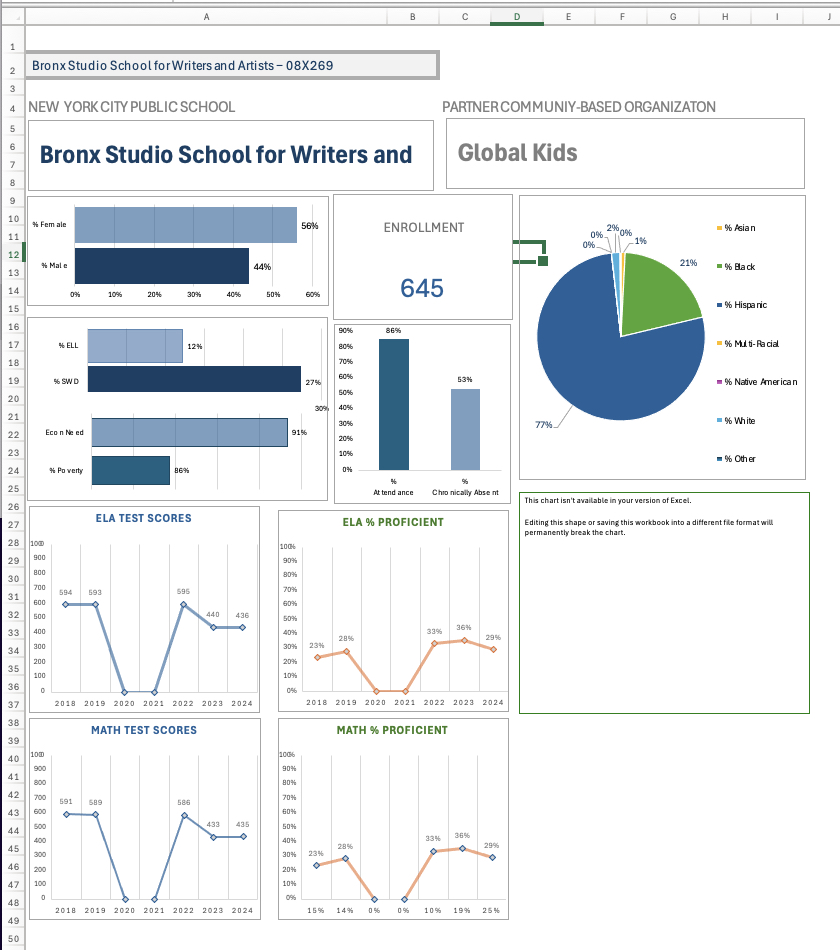

# PER SCHOLAS MERN STACK CAPSTONE PROJECT

NYC Community Schools Data Dashboard (2018 - 2025) created wih MERN (Mongo.db, Express, React.js, Node.js):

## Project Inspiration

### Backend Initializaon & Dependencies

`npm i express mongoose cors dotenv urlencoded`

### Development Dependencies

`npm --start-dev nodemon`

### Encryption Dependencies

`npm install bcryptjs jsonwebtoken`

### Frontend Creaton & Dependencies

`npx create-react-app frontend`
`npm i axios react-router-dom`
`npm install chart.js react-chartjs-2 react-leaflet leaflet`

## Project Overview

Seed data on 280 NYC schools with each individual school having 78 variables:

1. SchoolDBN String [true, "Enter the school district borough number"]
2. SchoolName String [true, "Enter the school name"]
3. StreetAddress String [true, "Enter the school's street address"]
4. ZipCode Number [true, "Enter the school's zip code"]
5. Neighborhood String [false, "Enter school neighborhood"]
6. District Number [true, "Enter school district number"]
7. Borough String [true, "Select school borough"] enum: ['Manhattan'', "Brooklyn", ''Queens'', Bronx'', "Staten Island']
8. SchoolType String [true, "Select school type"] enum: ['General Education''Special Education']
9. GradeLevel String [true, "Select grade level"] enum: ["Elementary'", 'Middle'', High'', K-8'', "6-12", ''K-12"]
10. CommunitySchool Boolean [true, "Is the school a community school"] default: false
11. CommunityBasedOrg String [false, "Enter the community-based partner for the school"]
12. PartnershipYearStart Number [false, "Select the year the community partnership started"] enum: [2015, 2016, 2017, 2018, 2019, 2020, 2021, 2022, 2023, 2024, 2025]
13. DataForSchoolYear Number [false, "Select the school year for the school data being entered"] enum: [2018, 2019, 2020, 2021, 2022, 2023, 2024]
14. Enrollment Number [true, "Enter total number of students enrolled in school"]
15. FemaleStudents Number [true, "Enter the percentage of students that are female"]
16. MaleStudents Number [true, "Enter the percentage of students that are male"]
17. SpecialNeedStudents Number [true, "Enter the percentage of students with special needs"]
18. ELLStudents Number [true, "Enter the percentage of students that are English Language Learners"]
19. LivingInPoverty Number [true, "Enter the percentage of students 80% below federal poverty line"]
20. EconomicNeed Number [true, "Enter the percentage of students that in economic need"]
21. AsianStudents Number [true, "Enter the percentage of students identified as Asian"]
22. BlackStudents Number [true, "Enter the percentage of students identified as Black"]
23. LatinoStudents Number [true, "Enter the percentage of students identified as Latino"]
24. MultiRaceStudents Number [true, "Enter the percentage of students identified as Multi-racial"]
25. NativeStudents Number [true, "Enter the percentage of students identified as Native American"]
26. WhiteStudents Number [true, "Enter the percentage of students identified as White"]
27. OtherStudents Number [true, "Enter the percentage of students identified as Other"]
28. Attendance2018Rate Number [false, "Enter the school attendance rate for 2018"]
29. Attendance2019Rate Number [false, "Enter the school attendance rate for 2019"]
30. Attendance2020Rate Number [false, "Enter the school attendance rate for 2020"]
31. Attendance2021Rate Number [false, "Enter the school attendance rate for 2021"]
32. Attendance2022Rate Number [false, "Enter the school attendance rate for 2022"]
33. Attendance2023Rate Number [false, "Enter the school attendance rate for 2023"]
34. Attendance2024Rate Number [false, "Enter the school attendance rate for 2024"]
35. Attendance2025Rate Number [false, "Enter the school attendance rate for 2025"]
36. Chronically2018Absent Number [false, "Enter the percentage of students chronically absent for 2018"]
37. Chronically2019Absent Number [false, "Enter the percentage of students chronically absent for 2019"]
38. Chronically2020Absent Number [false, "Enter the percentage of students chronically absent for 2020"]
39. Chronically2021Absent Number [false, "Enter the percentage of students chronically absent for 2021"]
40. Chronically2022Absent Number [false, "Enter the percentage of students chronically absent for 2022"]
41. Chronically2023Absent Number [false, "Enter the percentage of students chronically absent for 2023"]
42. Chronically2024Absent Number [false, "Enter the percentage of students chronically absent for 2024"]
43. Chronically2025Absent Number [false, "Enter the percentage of students chronically absent for 2025"]
44. Avg2018ELAScore Number [false, "Enter the average score for English Language Arts in 2018"]
45. Avg2019ELAScore Number [false, "Enter the average score for English Language Arts in 2019"]
46. Avg2020ELAScore Number [false, "Enter the average score for English Language Arts in 2020"]
47. Avg2021ELAScore Number [false, "Enter the average score for English Language Arts in 2021"]
48. Avg2022ELAScore Number [false, "Enter the average score for English Language Arts in 2022"]
49. Avg2023ELAScore Number [false, "Enter the average score for English Language Arts in 2023"]
50. Avg2024ELAScore Number [false, "Enter the average score for English Language Arts in 2024"]
51. Avg2025ELAScore Number [false, "Enter the average score for English Language Arts in 2025"]
52. Proficient2018ELA Number [false, "Enter the percentage of student scores at or above the proficient level for ELA in 2018"]
53. Proficient2019ELA Number [false, "Enter the percentage of student scores at or above the proficient level for ELA in 2019"]
54. Proficient2020ELA Number [false, "Enter the percentage of student scores at or above the proficient level for ELA in 2020"]
55. Proficient2021ELA Number [false, "Enter the percentage of student scores at or above the proficient level for ELA in 2021"]
56. Proficient2022ELA Number [false, "Enter the percentage of student scores at or above the proficient level for ELA in 2022"]
57. Proficient2023ELA Number [false, "Enter the percentage of student scores at or above the proficient level for ELA in 2023"]
58. Proficient2024ELA Number [false, "Enter the percentage of student scores at or above the proficient level for ELA in 2024"]
59. Proficient2025ELA Number [false, "Enter the percentage of student scores at or above the proficient level for ELA in 2025"]
60. Avg2018MathScore Number [false, "Enter the average score for Math in 2018"]
61. Avg2019MathScore Number [false, "Enter the average score for Math in 2019"]
62. Avg2020MathScore Number [false, "Enter the average score for Math in 2020"]
63. Avg2021MathScore Number [false, "Enter the average score for Math in 2021"]
64. Avg2022MathScore Number [false, "Enter the average score for Math in 2022"]
65. Avg2023MathScore Number [false, "Enter the average score for Math in 2023"]
66. Avg2024MathScore Number [false, "Enter the average score for Math in 2024"]
67. Avg2025MathScore Number [false, "Enter the average score for Math in 2025"]
68. Proficient2018Math Number [false, "Enter the percentage of student scores at or above the proficient level for Math in 2018"]
69. Proficient2019Math Number [false, "Enter the percentage of student scores at or above the proficient level for Math in 2019"]
70. Proficient2020Math Number [false, "Enter the percentage of student scores at or above the proficient level for Math in 2020"]
71. Proficient2021Math Number [false, "Enter the percentage of student scores at or above the proficient level for Math in 2021"]
72. Proficient2022Math Number [false, "Enter the percentage of student scores at or above the proficient level for Math in 2022"]
73. Proficient2023Math Number [false, "Enter the percentage of student scores at or above the proficient level for Math in 2023"]
74. Proficient2024Math Number [false, "Enter the percentage of student scores at or above the proficient level for Math in 2024"]
75. Proficient2025Math Number [false, "Enter the percentage of student scores at or above the proficient level for Math in 2025"]
76. SchoolLatitude Number [false, "Enter the latitudinal coordinates of the school"]
77. SchoolLongitude Number [false, "Enter the longitudinal coordinates of the school"]
78. timestamps

- Two models:

  - District Administrator:
    - Capabilities: Create, Read, Update, Delete
    - Means to Access Data: Form
    -
  - General Public User:

    - Capabilities: GET all or GET data on one school
    - Means to Access Data: Drop-down selector on Data Dashboard

  - Pages
    - Data dashboard on two pages
      - Page with school demographic data, attendance data and NYC map with school locaton starred
      - Page with school schievement data on ELA and Math
      - Selector with each schools as an opton and autopopulates each dashboard
      - CRUD operations performed with form are instantly updated on dara dashboard
    - All pages have navigation to the other pages

## Technology Employed

#### WireFrame

- MS Excel :: Wireframe Model
- Minify :: Convert MS Excel Data to JSON Object

  

#### BackEnd

#### FrontEnd

## Project Tutorials

- Title: Final Office Hours
- Creator: Sir Bryan Santos
- Access Location: Per Scholas Canvas Instructure

- Title: How To Structure React Projects From Beginner To Advanced
- Creator: Web Dev Simplified
- Access Location: Creator Blog on WWW

- Title: Learn React In 30 Minutes
- Creator: Web Dev Simplified
- Medium: YouTube

- Title: Learn React With This One Project
- Creator: Web Dev Simplified
- Medium: YouTube

- Title: Learn React – A Handbook for Beginners
- Creator: Nathan Sebhastian
- Medium: FreeCodeCamp Article

- Title: React Fundamentals - Full Course for Beginners
- Creator: FreeCodeCamp
- Medium: YouTube

- Title: API Tutorial
- Creator: Coding Creativelyfor Free Code Camp
- Access Location: YouTube

- Title: Submit Form Data To REST API In A React App
- Creator: CodeARIV
- Access Location: YouTube

- Title: React & Form Data
- Creator: Cosden Solution
- Access Location: YouTube

- Title: Get Started with Chart.js
- Creator: Chart.js
- Access Location: Creator White Paper Documentaton on Google

- Title: React Charts-Simple, Immersive Interactive Charts for React
- Creator: React Charts
- Access Location: Creator White Paper Documentaton on Google

- Title: React Leaflet: React components for Leaflet maps
- Creator: React Leaflet
- Access Location: Creator White Paper Documentaton on Google

- Title: Authentication to Your App With BCrypt and JWT## Research Resources
- Creator: Madeline Corman
- Access Location: Medium.com Article

- Title: Build A MERN Finance Dashboard App | Machine Learning
- Creator: EdRoh
- Access Location: YouTube

- Mastering MERN: Crafting an Elegant Admin Dashboard
- Creator: EdRoh
- Access Location: YouTube

- Creating Dashboard Charts, MERN STACK COURSE
- Creator: Six Pack Programmer
- Access Location: Youtube

### List of Community Schools

https://sites.google.com/mynycschool.org/newyorkcitycommunityschools/our-schools-1

### Rand Report On The Impact of COVID on NYC Schools

- Illustrating the Promise of Community Schools
  An Assessment of the Impact of the New York City Community Schools Initiative
  William R. Johnston, John Engberg, Isaac M. Opper, Lisa Sontag-Padilla, Lea Xenakis
  RESEARCH Published Jan 28, 2020
  https://www.rand.org/pubs/research_reports/RR3245.html

### NYCDOE Open Data

https://tools.nycenet.edu/dashboard/#dbn=07X334&report_type=HS&view=City

### NYC Open Data

- 2019-20 Demographic Data In NYC Public Schools Suppressed - Pre-K, K-8 & 9-12 Grades
- 2016-17 - 2020-23 Citywide End-of-Year Attendance and Chronic Absenteeism Data

### NYCDOE Office of Organizational Data: LCGMS Report (Location Data)

https://infohub.nyced.org/in-our-schools/operations/lcgms
